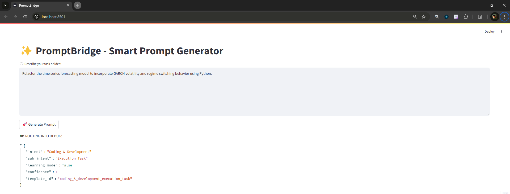
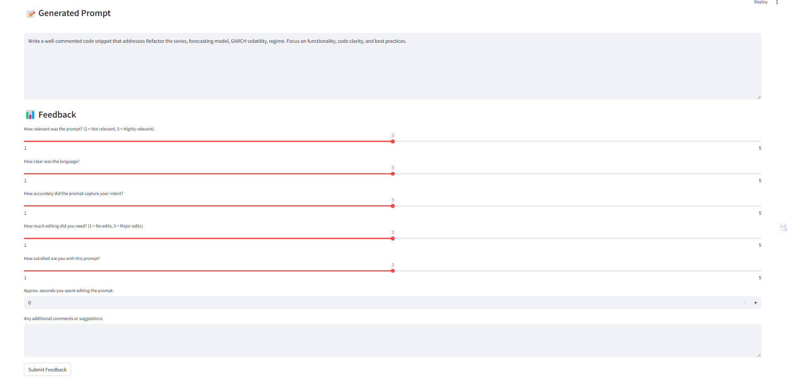
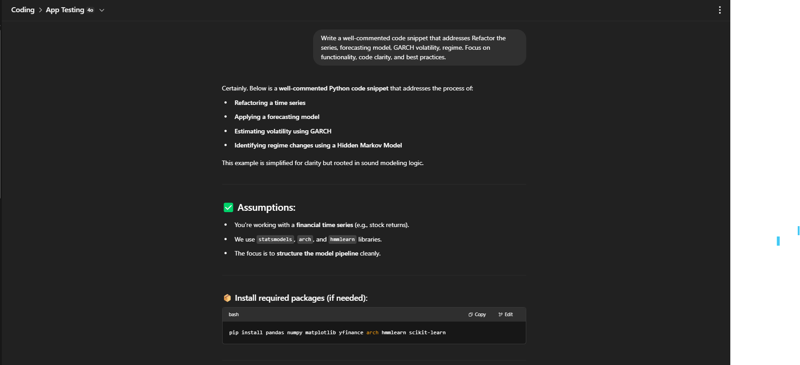

# PromptBridge

**PromptBridge** is a modular, NLP-powered app that transforms raw human input into optimized, machine-ready prompts—designed for LLMs like ChatGPT, Google AI Studio, and others.

---

## 🔍 Why PromptBridge?

Crafting clear prompts is hard.  
PromptBridge helps users—technical and non-technical—convert natural language thoughts into structured prompts that AI can understand more effectively.

Inspired by how modern LLMs use **Chain-of-Thought reasoning**, PromptBridge brings that internal logic to the user side.

---

## 🧠 Core Features

- Intent detection + context classification
- Technicality detection and override routing
- Keyword extraction + grammar shaping
- Prompt templates tailored for tasks (code, analytics, ideation)
- Feedback logging and improvement loop
- Streamlit-based UI

---

## 🚀 Use Cases

- Marketing prompt ideation (WhatsApp/email campaigns)
- Data & analytics prompt workflows
- Code generation and project structuring
- Local language prompt conversion (coming soon)
- Image generation prompt support (in progress)

---

## ⚙️ Tech Stack

- Python  
- Streamlit  
- spaCy, Transformers  
- MySQL  
- dotenv (for config)

---

## 📸 Examples

### Raw Input → Prompt Output → AI Response

  
  


## 📂 Run the App

```bash
pip install -r requirements.txt
streamlit run app/main.py


